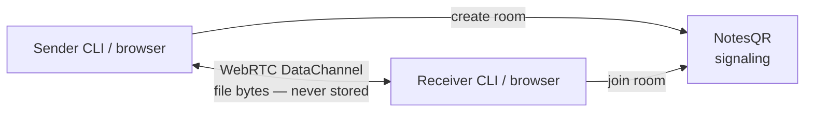

# NotesQR Share

**Send files directly device-to-device over WebRTC — files never touch NotesQR's servers.**

CLI + MCP for [NotesQR](https://notesqr.com). Same rooms as the browser app. Both peers stay online; bytes never land on NotesQR disks.

<p align="center">
  <a href="https://github.com/NotesQR/notesqr-share/stargazers"></a>
  <a href="LICENSE"></a>
  
  
  
  <a href="https://github.com/NotesQR/notesqr-share/commits/main"></a>
</p>

<p align="center">
  <a href="https://notesqr.com"><strong>Web app</strong></a>
  ·
  <a href="https://notesqr.com/donate"><strong>Donate</strong></a>
  ·
  <a href="CONTRIBUTING.md"><strong>Contribute</strong></a>
  ·
  <a href="https://notesqr.com/docs">Docs</a>
  ·
  <a href="https://github.com/NotesQR/NotesQR">Product README</a>
</p>

<p align="center"><em>Donation-funded. If this CLI saved you a WeTransfer upload, <a href="https://notesqr.com/donate">support the project</a>.</em></p>

<p align="center">
  <a href="https://notesqr.com"></a>
</p>

**Current release: 2.1.0** — same transfer engine as the NotesQR web app (adaptive chunks up to 1 MiB, `zip_batch` DataChannel reuse, outbound concurrency 5→32).

---

## CLI

Needs [Node.js 18+](https://nodejs.org/). If `npx github:…` fails with `EALLOWGIT`, run `npm config set allow-git all` once, or clone this repo.

Prefer a **fresh** `npx` pull after upgrades so you are not stuck on an old cached checkout:

```bash
# Terminal A — sender (exits after successful delivery with --once)
npx -y github:NotesQR/notesqr-share send ./file.pdf --once

# Terminal B — or open the printed URL in a browser
npx -y github:NotesQR/notesqr-share recv https://notesqr.com/xxx-xxxx-xxx -o ./out
```

From a clone:

```bash
npm install
node cli/notesqr.mjs send ./file.pdf --once
node cli/notesqr.mjs recv <url> -o ./out
```

### Folders

`send` accepts directories (recursive). Peers only see **share-relative** paths (never absolute disk paths). `recv` recreates the tree under `-o`. Same folder flow exists on the web app, desktop installers, and browser extensions.

```bash
npx -y github:NotesQR/notesqr-share send ./project/ README.md --once
npx -y github:NotesQR/notesqr-share recv <room|url> -o ./out
```

<p align="center">
  
</p>

---

## MCP

Agent tools `notesqr_p2p_send` / `notesqr_p2p_recv` — same P2P rooms, no store-and-forward API.

```json
{
  "mcpServers": {
    "notesqr": {
      "command": "npx",
      "args": ["-y", "-p", "github:NotesQR/notesqr-share", "notesqr-mcp"]
    }
  }
}
```

Docs: [notesqr.com/docs](https://notesqr.com/docs) · Agent hints: [notesqr.com/llms.txt](https://notesqr.com/llms.txt)

---

## Why not WeTransfer, Dropbox, or Google Drive?

- **WeTransfer** — uploads to their servers; free tiers cap size and expiry. This CLI never parks a copy on NotesQR disks.
- **Dropbox** — account + cloud folder/quota. NotesQR needs no account; sender stays online instead.
- **Google Drive** — share a hosted copy. NotesQR is a live WebRTC handoff, not a drive.

Full write-up: [notesqr.com/cloud-alternatives](https://notesqr.com/cloud-alternatives)

---

## How it works



TURN is a **fallback only** when a direct path is blocked.

1. Sender hosts a room and stays online
2. Prints `https://notesqr.com/{room}` (and a terminal QR)
3. Receiver joins while the sender is still running
4. Bytes go peer-to-peer (signaling + optional TURN only)

This is **not** an HTTP store-and-forward upload API. If the sender process exits before the download finishes, the transfer stops.

---

## What’s new in 2.1.0

- **Adaptive chunks** — probe SCTP `maxMessageSize`, send up to 1 MiB, step down if the peer rejects
- **`zip_batch`** — folder / multi-file transfers reuse one DataChannel (critical when a web guest downloads a folder from a CLI host)
- **Outbound concurrency** — base 5, grow toward 32 while in-flight bytes stay under ~10 MiB
- **Large rooms** — file list sent in ~180 KiB JSON batches
- **Recv** — multi-file downloads largest-first; stall watchdog instead of a hard wall-clock timeout from t=0

---

## Agent plugins

| Surface | Path |
| --- | --- |
| **Grok** | [`grok-plugin/`](grok-plugin/) — also listed on the [xAI Plugin Marketplace](https://github.com/xai-org/plugin-marketplace) as **notesqr** |
| **Cursor** | [`cursor-plugin/`](cursor-plugin/) |
| **Gemini CLI** | [`gemini-extension.json`](gemini-extension.json) · `gemini extensions install https://github.com/NotesQR/notesqr-share` |
| **Claude / Codex** | [`claude-plugin/`](claude-plugin/) · [`codex-plugin/`](codex-plugin/) |

---

## License

[MIT](LICENSE). Product: [notesqr.com](https://notesqr.com) · [Donate](https://notesqr.com/donate) · [Changelog](https://notesqr.com/changelog)
